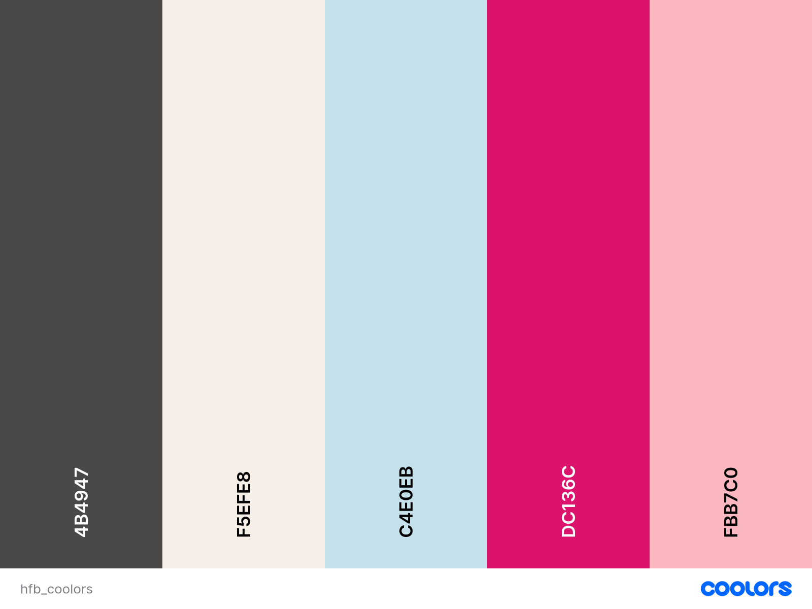
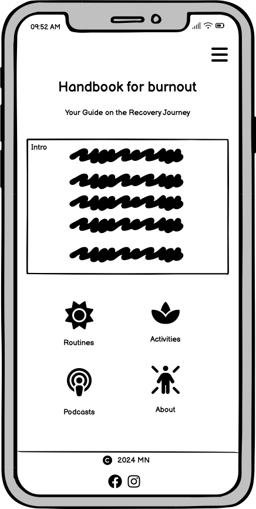
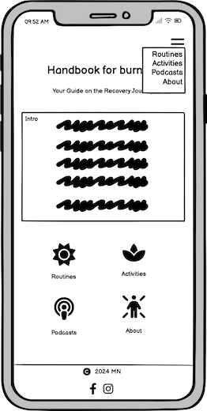
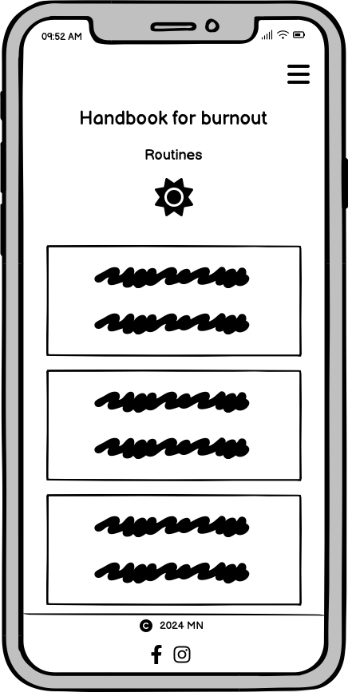
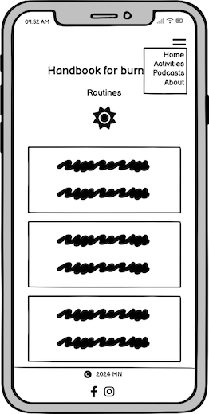
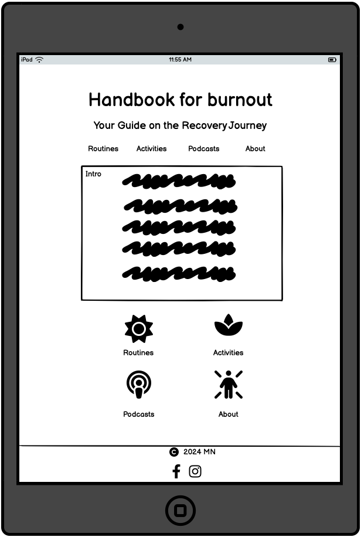
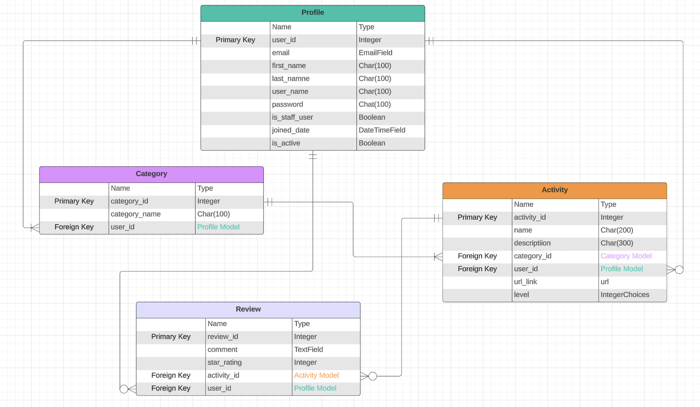
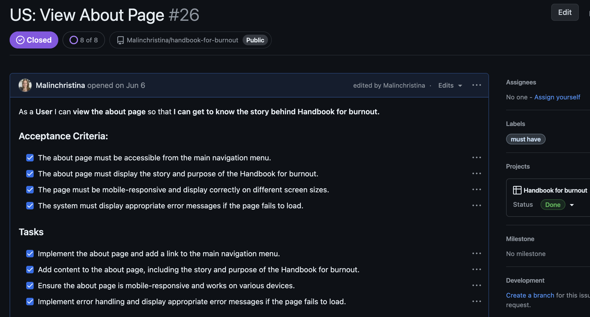

# Handbok for Burnout: Your Guide on the Recovery Journey

## Introduction
Handbok for Burnout is a supportive community app designed specifically for individuals experiencing burnout. This blog-style platform offers a curated collection of resources, including podcast recommendations, low-impact activities, meditations, and personalized routines to aid in recovery.

We understand that when one is experiencing burnout, even simple tasks like googling for tips can feel overwhelming. That’s why we’ve created Handbok for Burnout – to provide a curated list of suggestions all in one place, making the recovery journey easier and less stressful. You can think of it as a library only for burnout.

To foster a sense of community and ensure a safe, interactive space, users must register and log in to read and comment on activities. This collaborative feature encourages meaningful engagement and connection among members who understand the journey of overcoming burnout.

## Deployed Site

Follow this link to view the deployed [site](https://handbook-for-burnout-4d6e57b49adf.herokuapp.com/) on Heroku.

## Table of Contents
## Table of Contents

- [User Experience (UX)](#user-experience-ux)
  - [Design Thinking](#design-thinking)
    - [Mobile First](#mobile-first)
    - [Design](#design)
    - [Colors](#colors)
- [Project Planning](#project-planning)
  - [Wireframes](#wireframes)
    - [Mobile](#mobile)
    - [Tablet](#tablet)
  - [Database Schema - Entity Relationship Diagram](#database-schema---entity-relationship-diagram)
  - [Models](#models)
    - [User](#user)
    - [Categories](#categories)
    - [Activities](#activities)
    - [Reviews](#reviews)
- [Agile Methodologies](#agile-methodologies)
  - [Kanban Board](#kanban-board)
  - [Epics](#epics)
  - [User Stories](#user-stories)
  - [MoSCoW Prioritization](#moscow-prioritization)
- [Technologies Used](#technologies-used)
  - [Languages](#languages)
  - [Frameworks](#frameworks)
  - [Libraries](#libraries)
  - [Tools & Programs](#tools--programs)
- [Testing](#testing)
- [Deployment](#deployment)
  - [GitHub](#github)
  - [Heroku](#heroku)
- [Features](#features)
  - [Future Features](#future-features)
    - [Analytics and Reporting](#analytics-and-reporting)
- [Credits](#credits)
  - [Code](#code)
  - [Media](#media)
  - [Acknowledgements](#acknowledgements)

    

## User Experience (UX)

The site is designed with a mobile-first approach, ensuring an optimal browsing experience on smartphones and tablets. This approach prioritizes fast load times, intuitive navigation, and responsive design, making the site accessible and user-friendly across all devices.

### Design Thinking

#### Mobile first

When designing the Django app, a mobile-first approach was adopted to ensure an optimal user experience across all devices. This strategy prioritizes the mobile interface, focusing on responsive design and usability for smaller screens. By starting with the constraints of mobile devices, the app's design and functionality were effectively scaled up for larger screens, resulting in a seamless and consistent experience for users on tablets and desktops as well. This approach ensures accessibility and performance, catering to the growing number of mobile users.

The design sizes in mind are
- 360px
- 768px
- 992px

#### Design

The design of the app focuses on providing easy navigation to ensure users with burnout can interact with the platform effortlessly. Simple layouts and intuitive navigation paths were prioritized to help users find and use the features they need without added stress. The activities themselves are designed to be the calming elements, allowing the app's interface to be straightforward and user-friendly.

The imagery used in the app was carefully chosen for its calming impression, contributing to the overall serene atmosphere of the platform. Soft colors, where possible, gentle gradients, and peaceful visuals are employed to reduce visual noise and create a soothing environment, helping users feel at ease as they engage with the app.

#### Colors

Base colors were chosen from the background image on index page at [Image Color Picker](https://imagecolorpicker.io). The rest of the colors were chosen on [Coolors](https://coolors.co).

Color Scheme

## Project planning

### Wireframes

Balsamiq was utilized to craft detailed wireframes that visually represented the app's design. These initial sketches served as the foundation for the app’s final structure and layout.

#### Mobile

#### Tablet

### Database Schema - Entity Relationship Diagram

The database schema for the application is illustrated using an Entity Relationship Diagram (ERD). [Lucidchart](https://www.lucidchart.com/) was used to design the ERD, providing a clear visual representation of the database structure. This diagram outlines the relationships between different entities in the project, ensuring efficient data organization and retrieval. The ERD served as a crucial tool in planning the database and outline the models.

### Models

#### User

In this project, Django's built-in User model is utilized for managing authentication and user-related data. The User model provides essential fields like username, email, and password, along with built-in functionalities for user authentication, permissions, and profile management. 

#### Categories

This is currently handled in the admin panel, and the view is there for future implementation when the project gets bigger and new categories need to be added easily.

The predefined categories are:
- Routines
- Podcasts
- Indoor activities
- Outdoor activities

These categories can only be handled by the admin user in the admin panel to ensure all activities are categorized correctly.

#### Activites

This model is used to enter various activities and categorize them under predefined categories. Each activity is assigned to a specific level:
- All Levels
- Level 1
- Level 2
- Level 3 

#### Reviews

The Review model is used to capture user feedback on activities. Each review includes fields such as comments, and the user who submitted the review. This model helps aggregate user opinions, providing valuable insights and enhancing the overall user experience.

## Agile Methodologies

Agile methodologies are used in this project to support iterative development and continuous improvement. By working in small, manageable increments and regularly reassessing priorities, Agile allows for flexibility and faster delivery of features. This approach also enables the integration of evolving requirements and feedback throughout the project, accommodating changes effectively

#### Kanban board

The Kanban board is used in this project to visualize and manage tasks. By organizing work into columns representing different stages (e.g., To Do, In Progress, Done), the Kanban board helps track progress and prioritize tasks efficiently.

View the bord for this project [here](https://github.com/users/Malinchristina/projects/3/views/1).

#### Epics

Epics are used in this project to organize and manage large features or objectives. Each epic represents a high-level goal that is broken down into smaller, manageable tasks or user stories. 

- [User Account Management](https://github.com/users/Malinchristina/projects/3/views/1?pane=issue&itemId=65593225)
- [Category Management](https://github.com/users/Malinchristina/projects/3/views/1?pane=issue&itemId=65875081)
- [Activity Management](https://github.com/users/Malinchristina/projects/3/views/1?pane=issue&itemId=65875615)
- [Review Management](https://github.com/users/Malinchristina/projects/3/views/1?pane=issue&itemId=65876051) 
 

#### User stories

User stories are used in this project to define and prioritize individual features or requirements from the user's perspective. Each user story outlines a specific need or goal, guiding the development of functionality in a user-centered manner. This approach helps ensure that each task contributes to the overall project objectives and allows for iterative refinement and adjustment.

View all user storys [here](https://github.com/users/Malinchristina/projects/3). 

Example of a User Story
 
 

#### MoSCoW prioritization

MoSCoW prioritization is used in this project to classify features into four categories: Must have, Should have, Could have, and Won't have. This approach helps ensure that critical features are delivered first, while less essential ones are prioritized accordingly, streamlining the development process.

### Technologies Used

#### Languages

- HTML
- CSS
- JavaScript
- Python

#### Frameworks

#### Libraries

#### Tools & Programs

### Testing

[Testing](testing.md) 

### Deployment

#### GitHub

#### Heroku

### Features

#### Future features

Epics
- [Analytics and Reporting](https://github.com/users/Malinchristina/projects/3/views/1?pane=issue&itemId=66415565)

### Credits

#### Code

#### Media

#### Acknowledgements