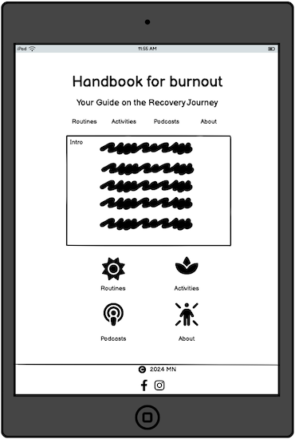

# Handbok for Burnout: Your Guide on the Recovery Journey

## Introduction
Handbok for Burnout is a supportive community app designed specifically for individuals experiencing burnout. This blog-style platform offers a curated collection of resources, including podcast recommendations, low-impact activities, meditations, and personalized routines to aid in recovery.

We understand that when one is experiencing burnout, even simple tasks like googling for tips can feel overwhelming. That’s why we’ve created Handbok for Burnout – to provide a curated list of suggestions all in one place, making the recovery journey easier and less stressful. You can think of it as a library only for burnout.

To foster a sense of community and ensure a safe, interactive space, users must register and log in to comment, rate, and contribute their own tips and suggestions. This collaborative feature encourages meaningful engagement and connection among members who understand the journey of overcoming burnout.

## Table of Contents

- [Project Planning](#project-planning)
    - [Wireframes](#wireframes)

## Project planning

### Wireframes

#### Mobile

 

#### Tablet

