# Handbok for Burnout: Your Guide on the Recovery Journey

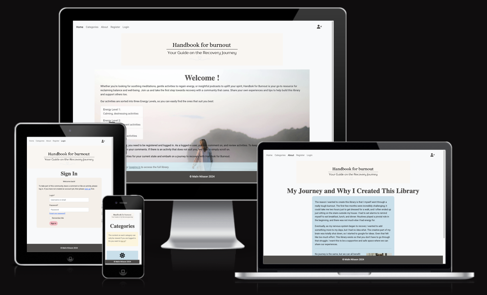

## Introduction
Handbok for Burnout is a supportive community app designed specifically for individuals experiencing burnout. This blog-style platform offers a curated collection of resources, including podcast recommendations, low-impact activities, meditations, and personalized routines to aid in recovery.

We understand that when one is experiencing burnout, even simple tasks like googling for tips can feel overwhelming. That’s why we’ve created Handbok for Burnout – to provide a curated list of suggestions all in one place, making the recovery journey easier and less stressful. You can think of it as a library only for burnout.

To foster a sense of community and ensure a safe, interactive space, users must register and log in to read and comment on activities. This collaborative feature encourages meaningful engagement and connection among members who understand the journey of overcoming burnout.

## Deployed Site

Follow this link to view the deployed [site](https://handbook-for-burnout-4d6e57b49adf.herokuapp.com/) on Heroku.

## Table of Contents
- [User Experience (UX)](#user-experience-ux)
  - [Design Thinking](#design-thinking)
    - [Mobile First](#mobile-first)
    - [Design](#design)
    - [Colors](#colors)
    - [Typography](#typography)
- [Features](#features)
  - [Index / Home](#index--home)
  - [Categories](#categories)
  - [Activity Pages](#activity-pages)
  - [Reviews](#reviews)
  - [About](#about)
  - [Add Activities](#add-activities)
  - [Register](#register)
  - [Login](#login)
  - [Logout](#logout)
  - [Future Features](#future-features)
- [Project Planning](#project-planning)
  - [Wireframes](#wireframes)
    - [Mobile](#mobile)
    - [Tablet](#tablet)
  - [Database Schema - Entity Relationship Diagram](#database-schema---entity-relationship-diagram)
  - [Models](#models)
    - [User](#user)
    - [Categories](#categories-1)
    - [Activities](#activities)
    - [Reviews](#reviews-1)
- [Agile Methodologies](#agile-methodologies)
  - [Kanban Board](#kanban-board)
  - [Epics](#epics)
  - [User Stories](#user-stories)
  - [MoSCoW Prioritization](#moscow-prioritization)
- [Technologies Used](#technologies-used)
  - [Languages](#languages)
  - [Frameworks](#frameworks)
  - [Libraries](#libraries)
  - [Tools & Programs](#tools--programs)
- [Testing](#testing)
- [Deployment](#deployment)
  - [GitHub](#github)
  - [Heroku](#heroku)
- [Credits](#credits)
  - [Code](#code)
  - [Media](#media)
- [Acknowledgements](#acknowledgements)
    

## User Experience (UX)

The site is designed with a mobile-first approach, ensuring an optimal browsing experience on smartphones and tablets. This approach prioritizes fast load times, intuitive navigation, and responsive design, making the site accessible and user-friendly across all devices.

### Design Thinking

#### Mobile first

When designing the Django app, a mobile-first approach was adopted to ensure an optimal user experience across all devices. This strategy prioritizes the mobile interface, focusing on responsive design and usability for smaller screens. By starting with the constraints of mobile devices, the app's design and functionality were effectively scaled up for larger screens, resulting in a seamless and consistent experience for users on tablets and desktops as well. This approach ensures accessibility and performance, catering to the growing number of mobile users.

The design sizes in mind are
- 360px
- 768px
- 992px

#### Design

The design of the app focuses on providing easy navigation to ensure users with burnout can interact with the platform effortlessly. Simple layouts and intuitive navigation paths were prioritized to help users find and use the features they need without added stress. The activities themselves are designed to be the calming elements, allowing the app's interface to be straightforward and user-friendly.

The imagery used in the app was carefully chosen for its calming impression, contributing to the overall serene atmosphere of the platform. Soft colors, where possible, gentle gradients, and peaceful visuals are employed to reduce visual noise and create a soothing environment, helping users feel at ease as they engage with the app.

#### Colors

Base colors were chosen from the background image on index page at [Image Color Picker](https://imagecolorpicker.io). The rest of the colors were chosen on [Coolors](https://coolors.co).

Color Scheme

#### Typography 

The fonts used in this project were retrieved from [Google Fonts](https://fonts.google.com/).

EB Garamond for headings and Robot for body.

## Features

### Index / Home

This page provides a brief overview of the app’s purpose and functionality. It explains how the app works and highlights that full access to the content requires user registration and login.

Click to view the image

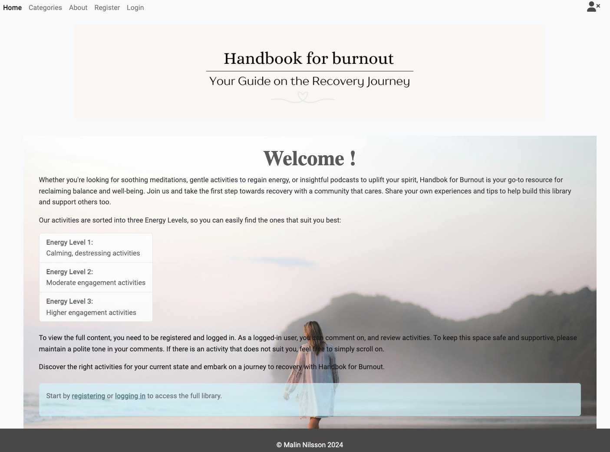

### Categories

The page presents the four different categories. The "cards" can only be accessed if logged in.

Click to view the image

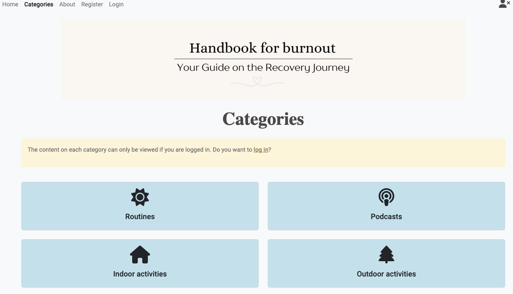

### Activity pages

The Activities page displays a list of activities, categorized by their energy level. Each activity entry may include links for more details. There is also a "Reviews" button, which shows the number of reviews for each activity and directs users to a page where they can read existing reviews or submit their own.

For superusers and staff users, edit and delete buttons are visible, allowing them to manage the activities.

 

Click to view the images

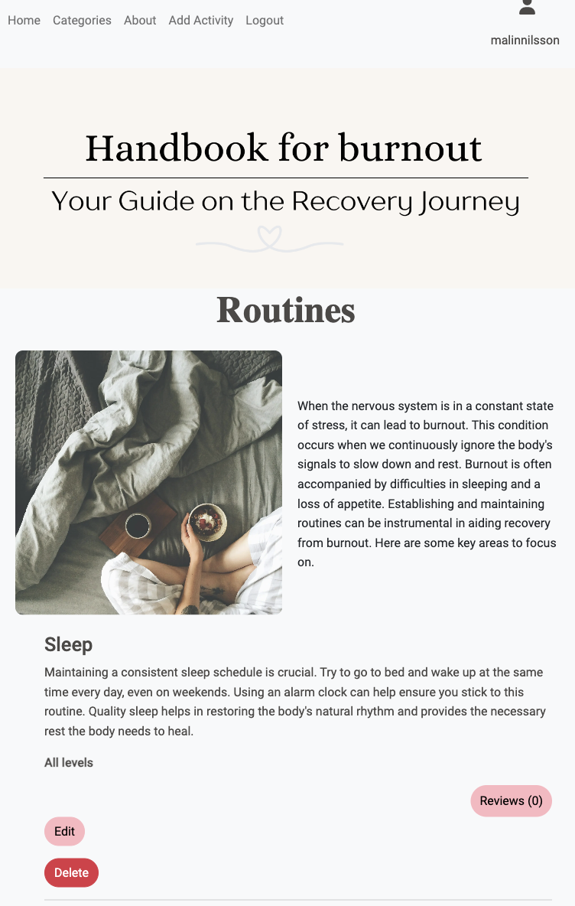

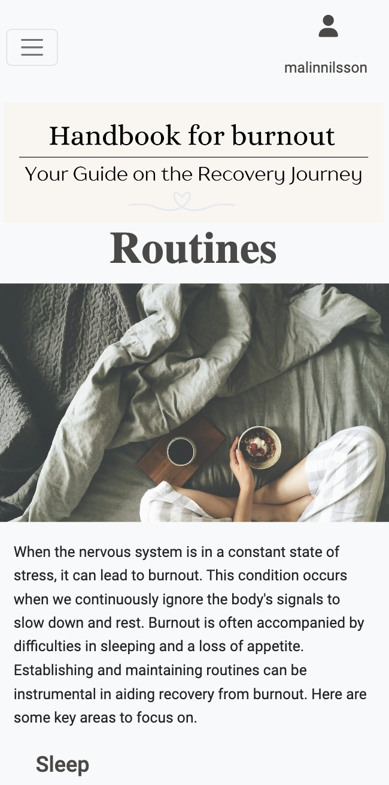

### Reviews

The Reviews page allows users to read reviews submitted by others and add their own feedback. If a user has created a review, they will see options to edit or delete their review. This feature helps ensure that feedback can be managed and updated as needed.

Click to view the image

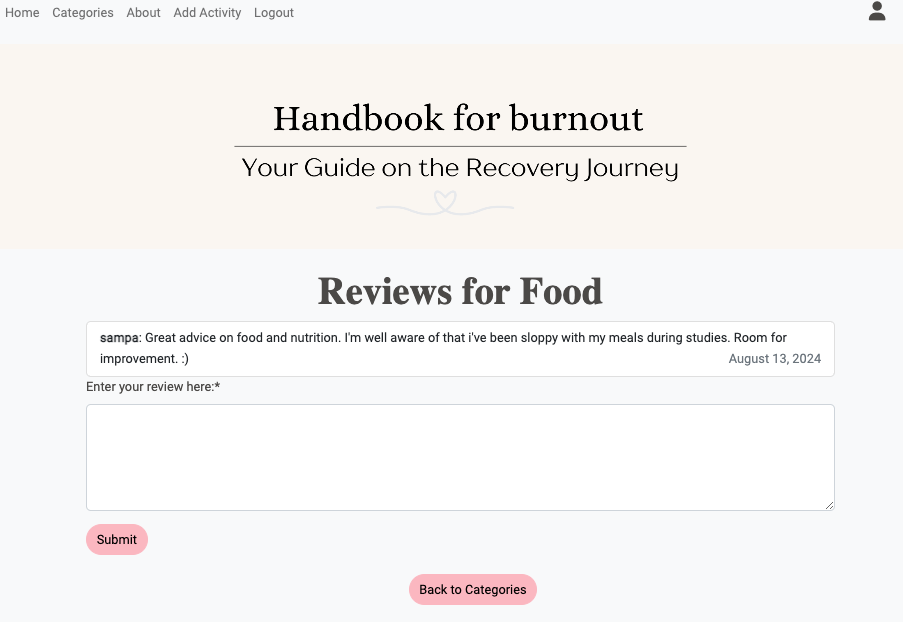

### About

The "About" page offers insight into the inspiration and purpose behind the creation of this library. It shares the personal journey of the creator, me, detailing the experiences with burnout and how these challenges led to the development of this supportive resource. The page aims to provide context for the library's existence and foster a sense of understanding and 
community for users.

Click to view the image

### Add activites

Provides a form for superusers and staff users to add new activities to the app.

Click to view the image

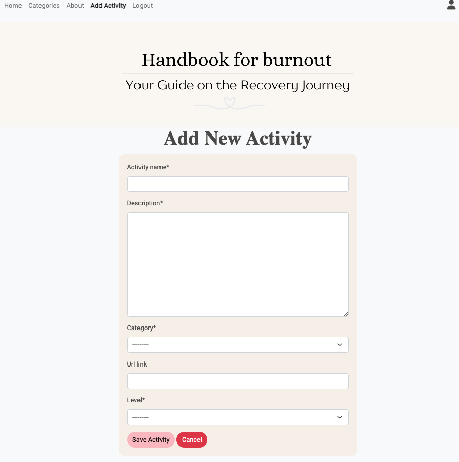

### Register

This page allows users to sign up and create a new account to gain access to all the content.

Click to view the image

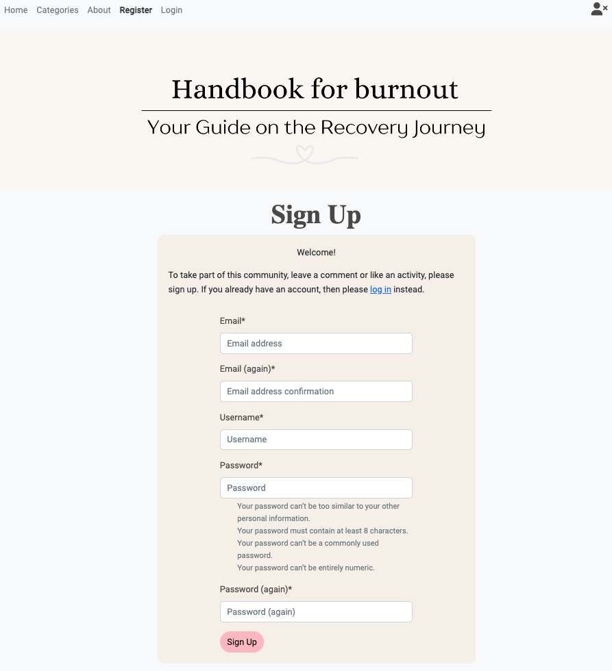

### Login

Allows users to access their account by logging in after account creation.

Click to view the image

### Logout

Signs users out of their account, providing a secure exit from the app.

Click to view the image

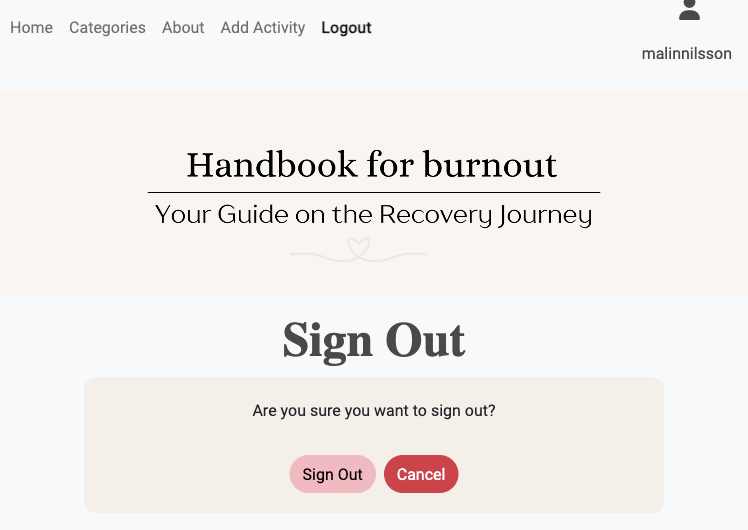

## Future features

- In the future, it would be ideal to manage categories directly from the app, allowing for easy addition and deletion.

- The ERD includes a model for users, which is planned as a future feature. This will enable users to have an account page where they can view their contributions.

- One EPIC feature that didn't make it into production is [Analytics and Reporting](https://github.com/users/Malinchristina/projects/3/views/1?pane=issue&itemId=66415565). This feature would be valuable for tracking user contributions and identifying the most viewed content.

All future features are specified under Future Feature in the [project board](https://github.com/users/Malinchristina/projects/3/views/1?visibleFields=%5B%22Title%22%2C%22Assignees%22%2C%22Status%22%2C%22Labels%22%5D). 

## Project planning

### Wireframes

Balsamiq was utilized to craft detailed wireframes that visually represented the app's design. These initial sketches served as the foundation for the app’s final structure and layout.

#### Mobile

Click to view wireframes

  
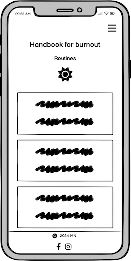

#### Tablet

Click to view wireframes

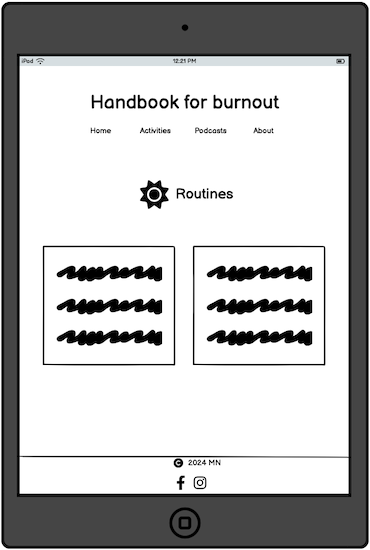

### Database Schema - Entity Relationship Diagram

The database schema for the application is illustrated using an Entity Relationship Diagram (ERD). [Lucidchart](https://www.lucidchart.com/) was used to design the ERD, providing a clear visual representation of the database structure. This diagram outlines the relationships between different entities in the project, ensuring efficient data organization and retrieval. The ERD served as a crucial tool in planning the database and outline the models.

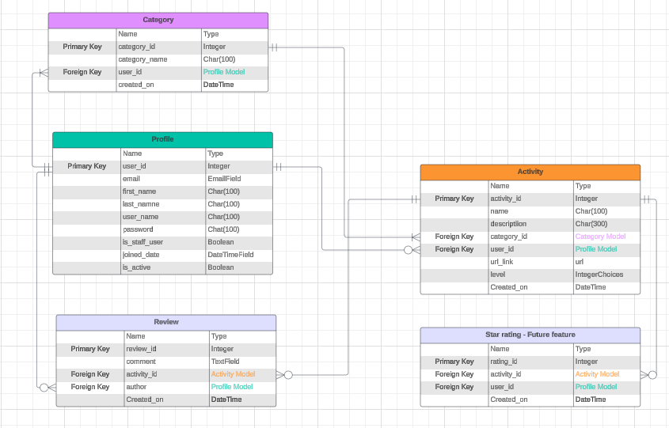

### Models

#### User

In this project, Django's built-in User model is utilized for managing authentication and user-related data. The User model provides essential fields like username, email, and password, along with built-in functionalities for user authentication, permissions, and profile management. 

#### Categories

This is currently handled in the admin panel, and the view is there for future implementation when the project gets bigger and new categories need to be added easily.

The predefined categories are:
- Routines
- Podcasts
- Indoor activities
- Outdoor activities

These categories can only be handled by the admin user in the admin panel to ensure all activities are categorized correctly.

#### Activites

This model is used to enter various activities and categorize them under predefined categories. Each activity is assigned to a specific level:
- All Levels
- Level 1
- Level 2
- Level 3 

#### Reviews

The Review model is used to capture user feedback on activities. Each review includes fields such as comments, and the user who submitted the review. This model helps aggregate user opinions, providing valuable insights and enhancing the overall user experience.

## Agile Methodologies

Agile methodologies are used in this project to support iterative development and continuous improvement. By working in small, manageable increments and regularly reassessing priorities, Agile allows for flexibility and faster delivery of features. This approach also enables the integration of evolving requirements and feedback throughout the project, accommodating changes effectively

#### Kanban board

The Kanban board is used in this project to visualize and manage tasks. By organizing work into columns representing different stages (e.g., To Do, In Progress, Done), the Kanban board helps track progress and prioritize tasks efficiently.

View the bord for this project [here](https://github.com/users/Malinchristina/projects/3/views/1).

#### Epics

Epics are used in this project to organize and manage large features or objectives. Each epic represents a high-level goal that is broken down into smaller, manageable tasks or user stories. 

- [User Account Management](https://github.com/users/Malinchristina/projects/3/views/1?pane=issue&itemId=65593225)
- [Category Management](https://github.com/users/Malinchristina/projects/3/views/1?pane=issue&itemId=65875081)
- [Activity Management](https://github.com/users/Malinchristina/projects/3/views/1?pane=issue&itemId=65875615)
- [Review Management](https://github.com/users/Malinchristina/projects/3/views/1?pane=issue&itemId=65876051) 
 

#### User stories

User stories are used in this project to define and prioritize individual features or requirements from the user's perspective. Each user story outlines a specific need or goal, guiding the development of functionality in a user-centered manner. This approach helps ensure that each task contributes to the overall project objectives and allows for iterative refinement and adjustment.

View all user storys [here](https://github.com/users/Malinchristina/projects/3). 

Example of a User Story
 
 

#### MoSCoW prioritization

MoSCoW prioritization is used in this project to classify features into four categories: Must have, Should have, Could have, and Won't have. This approach helps ensure that critical features are delivered first, while less essential ones are prioritized accordingly, streamlining the development process.

## Technologies Used

#### Languages

- HTML
- CSS
- JavaScript
- Python

#### Frameworks

- Django: A Python framework utilized for building and managing the web application.
- Bootstrap 5: A CSS framework employed for styling and ensuring a responsive design.

#### Libraries & Packages

- crispy-bootstrap5: Integrates Bootstrap 5 with Django forms for enhanced styling.
- dj-database-url: Configures Django database settings from a database URL.
- django-allauth: Handles authentication and account registration in Django.
- django-crispy-forms: Simplifies the rendering of Django forms.
- gunicorn: A WSGI HTTP server for UNIX, often used to serve Django applications.
- psycopg2: PostgreSQL adapter for Python, used for interacting with PostgreSQL databases.

#### Tools & Programs

- VSCode
- Github Pages
- Github Kanban Board
- Code Institute Postgres database
- Chrome Dev tools
- Lucidchart to create the database schema
- Balsamiq to create wireframes
- Heroku for app deployment
- PEP8 to check PEP8 requirements
- HTML Validator
- W3 CSS Validator
- JShint
- Convertio to convert img from jpeg/png to webp
- Pexels to get images for the app
- ChatGPT for texts
- Favicon.io for favicon
- Fontawesome for icons

### Testing

Find detailed at [Testing](testing.md) 

## Deployment

The app was created in Visual Studio Code editor desktop app.

### GitHub

The repository was created and stored on GitHub. Any changes made in VS Code was done with the commands.
 - git add .
 - git commit -m "Commit message"
 - git push

 Branches were created to maintain a clear separation between stable, fully functional code and experimental or trial code. The branching strategy and commands used were adapted from lessons learned during the May Hackathon and the project [RemindiCare](https://github.com/JohnnySonTrinh/remindicare/blob/main/CONTRIBUTING.md). 

### Heroku

The steps to deploy in Heroku:

1. Log in to Heroku
2. Create new app 
3. In settings press Reveal Config Vars and add:
    - DATABASE_URL
    - SECRET_KEY
4. Scroll down to add buildpack heroku/python
5. In Deploy connect to GitHub and find the repository
6. Scroll down and connect, in this case, manually on Deploy Branch.
7. Click open app to view the deployed app

Click to view Heroku deployment images

    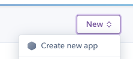
    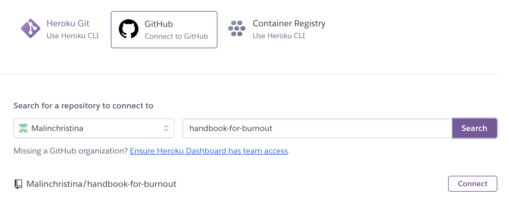
    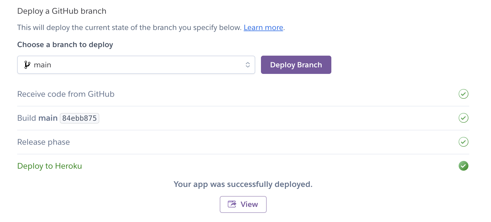
  

## Credits

### Code

#### Bootstrap

[Bootstrap](https://getbootstrap.com/) was used in this project to create a responsive and consistent design, leveraging its built-in components for efficient layout management.

#### Django

[Django](https://docs.djangoproject.com/en/5.0/) was used in this project as the primary web framework, providing robust tools for rapid development, secure authentication, and a scalable structure to handle both front-end and back-end needs.

#### Allauth

[Django Allauth](https://docs.allauth.org/en/latest/account/configuration.html) was used in this project to handle user authentication, specifically providing seamless email verification during the registration process to ensure secure account creation and management.

- Much inspiration and some code is from Code Institutes Blog walkthrough project.
- Inspiration and learning from [Daisy McGirr Recipe Sharing Tutorial](https://www.youtube.com/@IonaFrisbee/featured).
- [Secure views](https://www.codu.co/articles/securing-django-views-from-unauthorized-access-npyb3to_), also by Daisy.
- Idea for password reset page from [Emmelie Kolmodin's PP4](https://github.com/Ko11e/Climb-that-wall).
- Previous button from [Niclas Hugdahl's PP4](https://github.com/NiclO1337/pp4-banana-palace/tree/main).
- Inspiration to delete views from [Raneem Yad's PP4](https://github.com/raneem-yad/project-portfolio-4).
- General searches for bugs and errors throughout the project were conducted using [W3schools](https://www.w3schools.com/), [MDN webdocs](https://developer.mozilla.org/en-US/), [Geeks for Geeks](https://www.geeksforgeeks.org/) and [Stack Overflow](https://stackoverflow.com/).
- Learn about ERD from [Lucidchart](https://help.lucid.co/hc/en-us/articles/16471565238292-Create-an-Entity-Relationship-Diagram-in-Lucidchart#export-erd).

#### Media

All content is written by me and adjusted with help of [ChatGPT](https://openai.com/chatgpt/) for better flow.

All links in activities are where they say they are from.

Images are from [Pexels](https://www.pexels.com/sv-se/). Images are converted by [Convertio](https://convertio.co).

Logo was created by me in [Canva](https://www.canva.com).

#### Acknowledgements

- Thanks to the swedish community in Slack for support and testing.
- A big shoutout to Niclas Hugdahl, Emmelie Kolmodin, Jörgen Jonsson, Ben Gilbert and Johnny Trinh for testing, input and emotional support during the PP4 rollercoaster.
- Thanks to my mentor Gareth McGirr for support and guidance.
- And a big thanks for all the support from my partner.

