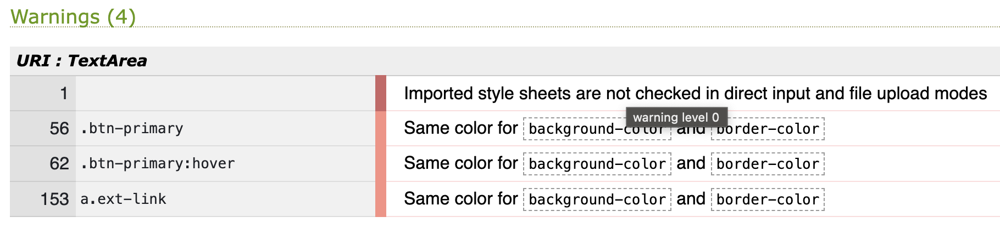
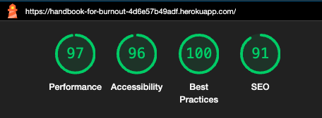
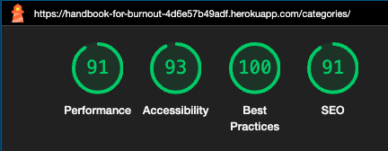
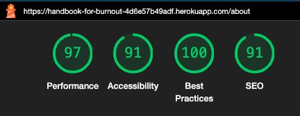
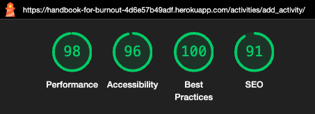
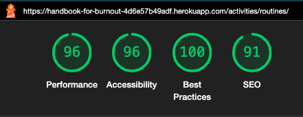
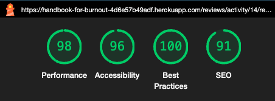
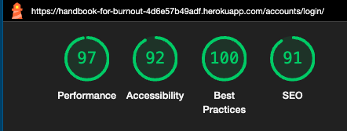
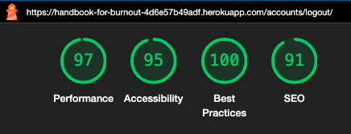

# Handbook For Burnout - Testing

# Table of Contents

- [Validator](#validator)
    - [HTML](#html)
    - [CSS](#css)
    - [JavaScript](#javascript)
    - [Python](#python)
- [Lighthouse](#lighthouse)
- [Manual Testing](#manual-testing)
    - [User Stories](#user-stories)
    - [Features](#features)
    - [Browsers](#browsers)
    - [Mobile](#mobile)
- [Bugs](#bugs)
    - [Solved Bugs](#solved-bugs)
    - [Unsolved Bugs](#unsolved-bugs)

[Readme](README.md)
## Validator

### HTML

[W3C](https://validator.w3.org/) was used to check HTML code. No unsolved errors.

### CSS

CSS was tested with [W3C](https://jigsaw.w3.org/css-validator/validator?uri=https%3A%2F%2Fhandbook-for-burnout-4d6e57b49adf.herokuapp.com%2F&profile=css3svg&usermedium=all&warning=1&vextwarning=&lang=en). The warnings received are ones that can be overlooked.

### JavaScript

[JS Hint](https://jshint.com/) was used to test the js code. All warnings such as unused functions fixed.

### Python

All python code was tested with [CI Python Linter](https://pep8ci.herokuapp.com/). All errors were fixed.

## Lighthouse

Lighthouse was used to analyze the performance, accessibility, and SEO of the web application. 

## Manual testing

### User stories

All user stories have been tested and function as expected according to their Acceptance Criteria.

| Test case ID | User Story | Name                                               | Status | Acceptance Criteria Pass/Fail |   |
|--------------|------------|----------------------------------------------------|--------|-------------------------------|---|
| TC1          | US#2       | [Staff user sign up](https://github.com/users/Malinchristina/projects/3/views/1?pane=issue&itemId=65590621)                                 | Done   | Pass                          |   |
| TC2          | US#4       | [User Sign-Up to View Activities](https://github.com/Malinchristina/handbook-for-burnout/issues/4#issue-2328626161)                    | Done   | Pass                          |   |
| TC3          | US#7       | [Deleting Staff Users Account](https://github.com/Malinchristina/handbook-for-burnout/issues/7)                       | Done   | Pass                          |   |
| TC4          | US#31      | [Add Staff User permission](https://github.com/Malinchristina/handbook-for-burnout/issues/31)                          | Done   | Pass                          |   |
| TC5          | US#11      | [Create and Edit Categories](https://github.com/Malinchristina/handbook-for-burnout/issues/11)                         | Done   | Pass                          |   |
| TC6          | US#12      | [View Categories](https://github.com/Malinchristina/handbook-for-burnout/issues/12)                                    | Done   | Pass                          |   |
| TC7          | US#24      | [Delete categories](https://github.com/Malinchristina/handbook-for-burnout/issues/24)                                  | Done   | Pass                          |   |
| TC8          | US#13      | [Activity Management for Site Admin and Staff Users](https://github.com/Malinchristina/handbook-for-burnout/issues/13) | Done   | Pass                          |   |
| TC9          | US#17      | [View activities](https://github.com/Malinchristina/handbook-for-burnout/issues/17)                                    | Done   | Pass                          |   |
| TC10         | US#18      | [Navigate to Linked Activity](https://github.com/Malinchristina/handbook-for-burnout/issues/18)                        | Done   | Pass                          |   |
| TC11         | US#19      | [Filter Activities Category](https://github.com/Malinchristina/handbook-for-burnout/issues/19)                         | Done   | Pass                          |   |
| TC12         | US#22      | [Site admin to manage reviews](https://github.com/Malinchristina/handbook-for-burnout/issues/22)                       | Done   | Pass                          |   |
| TC13         | US#20      | [View Comments on Activities](https://github.com/Malinchristina/handbook-for-burnout/issues/20)                        | Done   | Pass                          |   |
| TC14         | US#23      | [Manage Own Reviews](https://github.com/Malinchristina/handbook-for-burnout/issues/23)                                 | Done   | Pass                          |   |

**[To top](#handbook-for-burnout---testing)**

### Features

| Features tested | Expected outcome | Testing | Result | Pass / Fail |
|---|---|---|---|---|
| Navbar |  |  |  |  |
| **Not logged in** |  |  |  |  |
| Home | Navigate to Home page | Click Home from another page | Home page is shown | Pass |
| Catgories | Navigate to Categories page | Click Categories from another page | Categories page is shown | Pass |
| About | Navigate to About page | Click About from another page | About page is shown | Pass |
| Register | Navigate to Register page | Click Register from another page | Register page is shown | Pass |
| Login | Navigate to Login page | Click Login from another page | Login page is shown | Pass |
| Icon | Navigate to Login page | Click on the icon | Login page is shown | Pass |
| Logo | Navigate to Home page | Click on the logo | Home page is shown | Pass |
| **Logged in as staff user superuser** |  |  |  |  |
| Home | Navigate to Home page | Click Home from another page | Home page is shown | Pass |
| Categories | Navigate to Categories page | Click Categories from another page | Categories page is shown | Pass |
| About | Navigate to About page | Click About from another page | About page is shown | Pass |
| Add Activities | Navigate to Add Activities page | Click Add Activities from another page | Add Activities page is shown | Pass |
| Logout | Navigate to Logout page | Click Logout from another page | Logout page is shown | Pass |
| Icon | Navigate to Logout page | Click on the icon | Logout page is shown | Pass |
| Logo | Navigate to Home page | Click on the logo | Home page is shown | Pass |
| **Logged in as user** |  |  |  |  |
| Home | Navigate to Home page | Click Home from another page | Home page is shown | Pass |
| Catgories | Navigate to Categories page | Click Categories from another page | Categories page is shown | Pass |
| About | Navigate to About page | Click About from another page | About page is shown | Pass |
| Logout | Navigate to Logout page | Click Logout from another page | Logout page is shown | Pass |
| Icon | Navigate to Logout page | Click on the icon | Logout page is shown | Pass |
| Logo | Navigate to Home page | Click on the logo | Home page is shown | Pass |
| **Home not logged in** |  |  |  |  |
| Alert message at bottom | Alert message is visible | Click link registering | Get to Register page | Pass |
| Alert message at bottom | Alert message is visible | Click link logging in | Get to Login page | Pass |
| **Home logged in user** |  |  |  |  |
| Alert message at bottom | Alert message is hidden |  |  | Pass |
| **Categories not logged in** |  |  |  |  |
| Alert message | Alert message is visible and link clickable | Click link log in | Get to Login page | Pass |
| Category cards | Cards not clickable |  |  | Pass |
| **Categories logged in** |  |  |  |  |
| Alert message | Alert message is hidden |  |  | Pass |
| Activites | Cards clickable and link to each activity | Click each card | Get to each activity page | Pass |
| About | Email links to email address | Link clicked, email received | Opens default email provider locally | Pass |
| Register |  |  |  |  |
| Log in link | Link to navigate to Login page | Click log up link | Login page is shown | Pass |
| Form | User feedback on every field | Fields not filled in then click sign up | User feedback is displayed | Pass |
| Sign up button | Register User and show sucess message | Button clicked | Lets one register and navigate to home page and display sucess message | Pass |
| Login |  |  |  |  |
| Sign up in link | Link to navigate to Register page | Click sign up link | Register page is shown | Pass |
| Forgotten password link | Link to custom page | Click link | Custom password reset page is shown | Pass |
| Form | User feedback on every field | Fields not filled in then click sign in | User feedback is displayed | Pass |
| Sign in btn | Sign in, hide Register in nav and display logout. Display success message and navigat to Home. | Click Sign in btn | Sign one in. Navigate to home, display success message. | Pass |
| Forgotten password page |  |  |  |  |
| Email link | Email links to email address | Link clicked, email received | Opens default email provider locally | Pass |
| Home btn | Navigate to Home page | Button clicked | Home page is displayed | Pass |
| Logout | Display sign out btn and cancel btn. Sign out btn sign one out, navigate to Home and display sucess message. Cancel navigates to home | Click sign out btn | Navigates to home. Success message is displayed | Pass |
| **Add Activity logged in as Superuser / Staff user** |  |  |  |  |
| Form | User feedback on every field. Not possible to submit if required fields are empty. Duplicate titles not allowed. | Fields not filled in then click save activity. Fill in duplicate title. | User feedback is displayed, not possible to submit w/o required or with duplicate title. | Pass |
| Save Activity btn | Save activity to correct category and display sucess message. Redirect to Categories page | Add activity and save it. | Navigates to Categories page, success message is displayed. activity is displayed on the correct page | Pass |
| Cancels btn | Cancel form, get back to previous page | Click cancel button | End up on page one entered from | Pass |
| **Activity page logged in as User** |  |  |  |  |
| Content | Show  Category description, title, activity description, level, link, review btn with no of reviews |  |  | Pass |
| Activity link | Link clickable and open in external tab | Click link | Link opens in external tab | Pass |
| Review btn | Show no of reviews for that specific activity, take on to reveiew list | Click btn | Navigates to review list for that specific activity | Pass |
| **Activity page logged in as Staff user / Superuser** |  |  |  |  |
| All as User | See above | See above | See above | Pass |
| Edit btn | Show edit btn under each activity. Navigates one to edit form. | Click edit btn | Navigate to Edit Activity form | Pass |
| Edit activity | Edit all fields, navigate to categories, display success message. | Editing different fields and save. | Navigates to Categories and display suggess message. | Pass |
| Delete btn | Show delete btn under each activity. Show delete modal. | Click delete btn | Show modal with close, delete option. | Pass |
| Delete activity | Delete activity, show sucess message. Navigate to Categories. | Click delete | Delete activity, navigate to Categories. Success message displyed. | Pass |
| Reviews |  |  |  |  |
| Content | Display what activity the reveiw is for, a list of reviews if any and form for adding reviews. Btn navigates to Categories | Click btn. | Navigate to Categories. | Pass |
| Form | Textfield with user feedback. Display submit btn. Not possible to submit empty field. Display success message. Stay on review list after submit. | Add an empty reveiw, submit. Add a review and submit. | Remain on review list after submit. Sucess message displayed. | Pass |
| **Author of review** |  |  |  |  |
| Display edit btn | Display edit btn on auhtors reveiw |  |  | Pass |
| Edit | Cancel abort edit and return to reviews list. Save navigates to reviews list. Display success message for edit. | Form the action for save and cancel btn. | Sucess message is show, navigate back to list. | Pass |
| Delete | Open modal on delete btn. Cancel abort. Delete removes the review. Stay on review list. | Form the action for cancel and delete btn. | Modal close on cancel, removal on delete, show updated list. Success message displayed. | Pass |

**[To top](#handbook-for-burnout---testing)**

### Browsers

The application has been tested on the following browsers:
- Chrome
- Edge
- Safari

#### Mobile

The site is tested on various Iphones, Androids such as Xiaomi Redmi Note and Samsung.

## Bugs

#### Solved bugs

- "Normal" coding bugs like spelling errors in links.
- Success messages not showing after delete.
- Not accessing the activity id in the database, fetch by pk instead.
- Many trial and error.
- Print console.log.

#### Unsolved bugs

No unresolved bugs to report.

