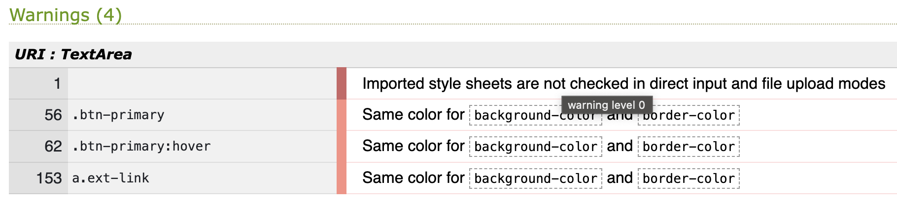

# Handbook For Burnout - testing

## Validator

### HTML

[W3C](https://validator.w3.org/) was used to check HTML code. No unsolved errors.

### CSS

CSS was tested with [W3C](https://jigsaw.w3.org/css-validator/validator?uri=https%3A%2F%2Fhandbook-for-burnout-4d6e57b49adf.herokuapp.com%2F&profile=css3svg&usermedium=all&warning=1&vextwarning=&lang=en). The warnings received are ones that can be overlooked.

### JavaScript

[JS Hint](https://jshint.com/) was used to test the js code. All warnings such as unused functions fixed.

### Python

All python code was tested with [CI Python Linter](https://pep8ci.herokuapp.com/). All errors were fixed.

## Lighthouse

## Manual testing

### User stories

### Browsers

## Bugs

